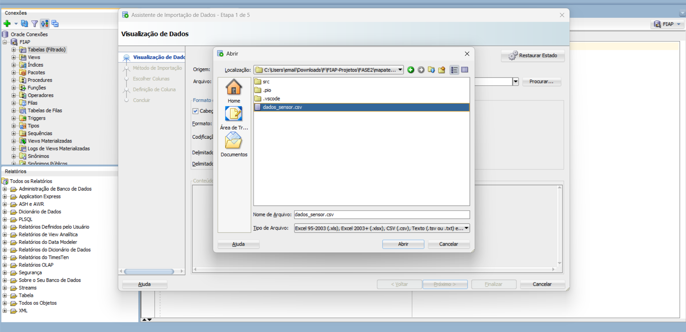
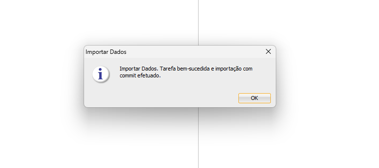
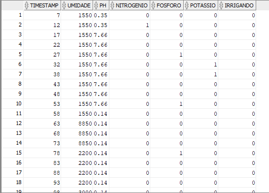
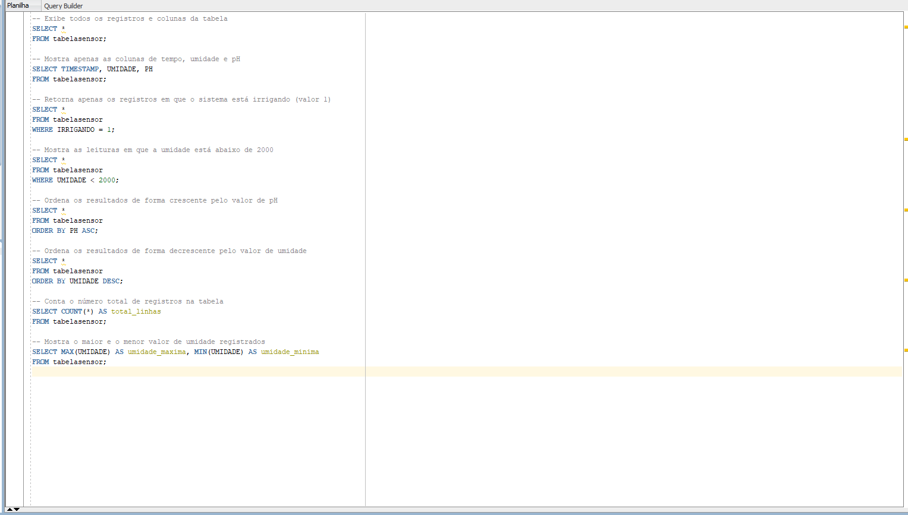

# FIAP - Faculdade de Informática e Administração Paulista

 

# Etapas de uma Máquina Agrícola / A primeira técnica de aprendizado de máquina
# <a href="https://youtu.be/X0QUsnb67K8">Link vídeo no Youtube</a>

## IA_Underground

## 👨‍🎓 Integrantes: 
- <a href="https://www.linkedin.com/company/inova-fusca">Danilo Marques Dantas</a>
- <a href="https://www.linkedin.com/in/marlonmarinho/">Marlon Paulino Marinho</a>
- <a href="https://www.linkedin.com/in/pedro-carvalho-cea-149658137/">Pedro Carvalho Rocha Lima</a> 
- <a href="https://www.linkedin.com/in/viniciusl7">Vinicius Lisboa Porto</a> 
- <a href="https://www.linkedin.com/in/vinigama">Vinicius de Santana Gama</a>

## 📜 Descrição

Este projeto tem como objetivo a criação de um Banco de Dados Oracle para o armazenamento dos dados do “mapadotesouro”, originalmente desenvolvidos na FASE 2 do curso.

Os dados utilizados nesta atividade foram reaproveitados de uma lição anterior, servindo como base prática para consultas e manipulação em SQL na FASE 3.

Durante o exercício, foram realizadas operações básicas de consulta (SELECT) utilizando a tabela tabelasensor, que contém informações sobre umidade, pH e nutrientes do solo (nitrogênio, fósforo e potássio), além do status de irrigação.

O foco da lição é consolidar o entendimento sobre:

- Criação e estruturação de tabelas em Oracle SQL;
- Inserção e leitura de dados;
- Execução de consultas simples e ordenadas;
- Interpretação dos resultados para análise de dados de sensores.

<h2 align="center">
 PROCESSO DE CRIAÇÃO DO SCRIPT BANCO DE DADOS
</h2>

<h3>ARQUIVO CONTENDO TODOS OS DADOS DO SENSOR</h3>

<h3>Tela de escolha de arquivo</h3>

<h3>Tela de Importação e consulta de Dados</h3>

<h3>Tela de confirmação</h3>

<h3>Tela de uso do banco de dados</h3>

<h3>Tela de uso do banco de dados</h3>

<h3>Tela de uso do banco de dados</h3>

## 📁 Estrutura de pastas/arquivos

Dentre os arquivos e pastas presentes na raiz do projeto, definem-se:

- <b>FIAP.sql</b>: Arquivo utilizado que contém todo o script utilizado para a criação da atividade "Etapas de uma Máquina Agrícola"

- <b>A_primeira_técnica_de_aprendizado_de_máquina</b>: Arquivo utilizado que contém todo o script utilizado para a criação da atividade "A primeira técnica de aprendizado de máquina"

- <b>assets</b>: aqui estão os arquivos relacionados a elementos não-estruturados deste repositório, como imagens.

- <b>README.md</b>: Arquivo que serve como guia e explicação geral sobre o projeto (o mesmo que você está lendo agora).

## 🔧 Como executar o código

- Clone este repositório;
- Acesse o Oracle SQL Developer;
- Conecte-se ao seu banco de dados Oracle com um usuário válido;
- Acesse o arquivo disponibilizado neste repositório "FIAP.sql"
- Execute as Queries com "Crtl + Enter"

## 🗃 Histórico de lançamentos

* 0.1.0 - 12/11/2025
  
